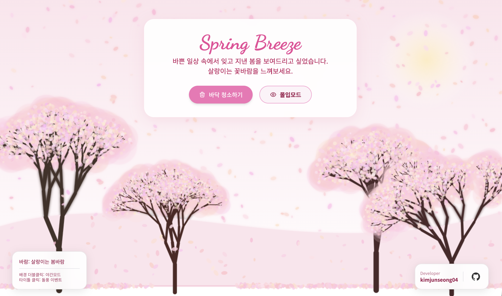
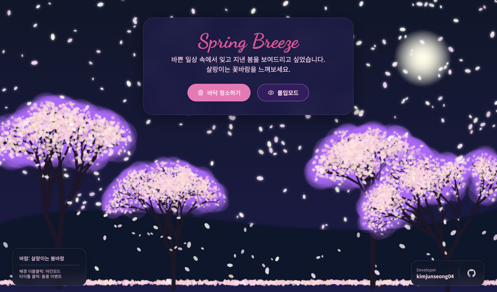

# 🌸 Cherry Blossoms

> **개발자가 봄을 보내는 방식.**

모니터 앞에 앉아 봄을 놓쳐버린 사람들을 위해 만들었습니다. ~~일단 나부터~~  
창문 밖에는 꽃이 지고 있는데, 코드는 아직 컴파일 중일 때  
이 페이지에서 잠깐 봄을 느껴보세요.

<br>

## 📸 스크린샷

| 🌸 라이트모드 (Light Mode) | 🌙 다크모드 (Dark Mode) |
|:-:|:-:|
|  |  |

<br>

## ✨ 기능

물리 엔진을 활용한 인터랙티브 벚꽃 시뮬레이션입니다.  
간단한 조작만으로 다양한 봄 날씨를 체험할 수 있어요.

| 인터랙션 | 설명 |
|---|---|
| 🖱️ **마우스 이동** | 꽃잎들이 마우스를 피해 흩어집니다 |
| 🌳 **나무 클릭** | 나무를 흔들어 꽃비를 내립니다 |
| 🌪️ **타이틀 클릭** | 5초간 강한 돌풍이 불어옵니다 |
| 🗑️ **바닥 청소** | 쌓인 꽃잎을 깔끔하게 치웁니다 |
| 🌙 **배경 더블클릭** | 낮/밤 테마를 전환합니다 |
| 👁️ **몰입 모드 (M)** | UI를 모두 가리고 꽃잎만 감상합니다 |

<br>

## 🧠 물리 엔진

단순히 예쁜 것에서 끝나지 않고, 실제 물리 연산을 구현했습니다.

- **LERP 보간** — 바람이 갑자기 바뀌지 않고 목표값으로 부드럽게 수렴
- **sin/cos 주기 함수** — 자연스러운 바람의 방향 변화
- **지수 감쇠 (`e^(-t)`)** — 나무 흔들림이 자연스럽게 잦아듦
- **공기 저항 (`vx *= 0.97`)** — 꽃잎이 무한히 빨라지지 않게 제어
- **재귀 나무 생성** — 가지가 depth에 따라 확률적으로 뻗어나감

<br>

## 🛠️ 사용 기술

```
HTML5 Canvas  — 물리 엔진 및 렌더링
Vanilla JS    — 모든 로직
Tailwind CSS  — UI 레이아웃
CSS           — 글래스모피즘 & 애니메이션
```

<br>

## 🚀 실행 방법

```bash
# 그냥 index.html 열면 됩니다
open app/index.html
```

<br>

## 📁 구조

```
cherry_blossoms/
├── app/
│   ├── index.html     # UI 마크업
│   ├── script.js      # 물리 엔진 & 렌더링
│   └── style.css      # 글래스모피즘 & 테마
├── images/
│   ├── light.png      # 낮 모드 스크린샷
│   └── dark.png       # 야간 모드 스크린샷
└── README.md
```

<br>

---

<div align="center">

made with 🌸 by [kimjunseong04](https://github.com/kimjunseong04)

</div>
